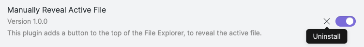

## "Reveal Active File Button" Obsidian Plugin

<!-- toc -->
## Contents

  * [Purpose](#purpose)
  * [Usage](#usage)
  * [Tips](#tips)
    * [If scroll position isn't quite correct](#if-scroll-position-isnt-quite-correct)
    * [If you tested version 1.0.0](#if-you-tested-version-100)
  * [Changelog](#changelog)
  * [Related Plugins](#related-plugins)
  * [Thanks](#thanks)<!-- endToc -->

## Purpose

**Reveal Active File Button** is an Obsidian plugin that adds a single-click button to **make the [Obsidian.md](https://obsidian.md) File Explorer/Navigator show your active file**, for example to find neighbouring files.

This is a convenient addition to these built-in options already included in Obsidian:

- The command "File explorer: Reveal active file in navigation"
- The pane menu option "Reveal file in navigation"

## Usage

To scroll Obsidian File Explorer/Navigator show your active file, click on the crosshairs icon:

The result:

## Tips

### If scroll position isn't quite correct

- If the File Explorer/Navigator does not quite scroll to the correct position, click the button a second time and it will work.
  - Explanation: the button simply invokes the built-in Obsidian command "File explorer: Reveal active file in navigation".
  - In large vaults, or for a file in a folder with a large number of files, the command does not always move to the correct position the first time.
  - A second request appears to work reliably. 

### If you tested version 1.0.0

If you are one of a few people that tested this plugin before it was added to the list of Community Plugins, you should remove that old version, as the plugin has been renamed.

**Method 1**: Please go to "Community plugins" in Obsidian settings in each vault, and uninstall the version with the old, original name "Manually Reveal Active File:

**Method 2**: If you installed via [BRAT](https://github.com/TfTHacker/obsidian42-brat), please go to "Obsidian42 - BRAT" in Obsidian settings in each vault, and remove this plugin from the Beta Plugin List: :

**Method 3**: Alternatively, you can delete this folder from each vault:

`.obsidian/plugins/obsidian-manually-reveal-active-file`

## Changelog

See [Changelog](CHANGELOG.md).

## Related Plugins

- [Collapse All](https://github.com/OfficerHalf/obsidian-collapse-all)
  - This plugin collapses and expands the file explorer
  - It is compatible with this plugin: both can be installed, and are useful alongside each other, as shown in this image:  
  
- [Automatically Reveal Active File](https://github.com/shichongrui/obsidian-reveal-active-file)
  - Use this if you always want the navigator to show the active file
  - And you don't mind Obsidian jumping away from other views, like Search results or the Tags panel

## Thanks

- This code is heavily based on Nathan Smith's [Collapse All](https://github.com/OfficerHalf/obsidian-collapse-all) plugin, with thanks.
