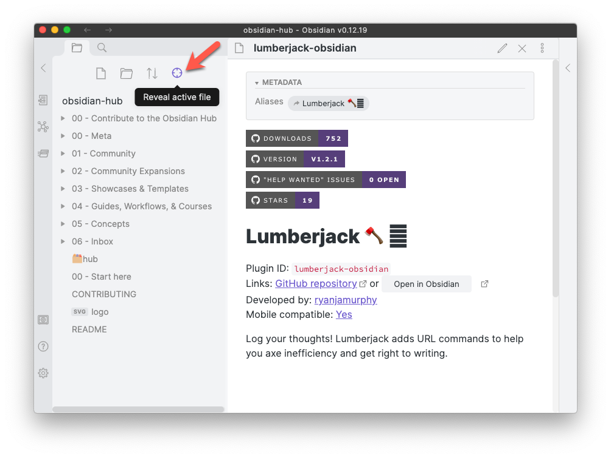
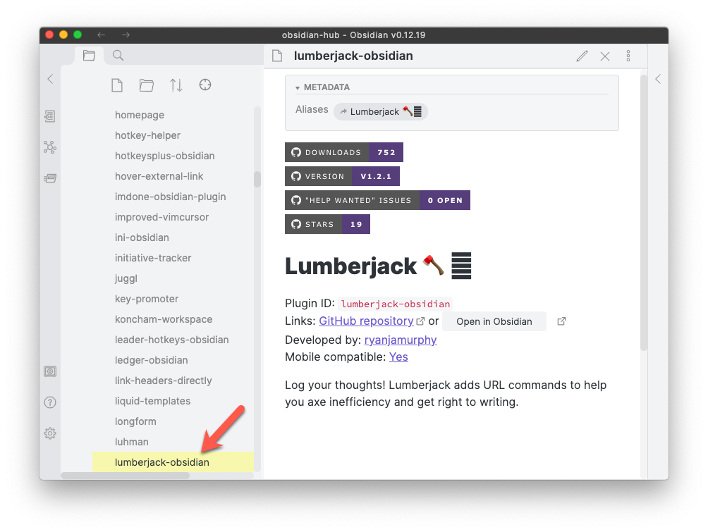

## "Reveal Active File Button" Obsidian Plugin

<!-- toc -->
## Contents

  * [Purpose](#purpose)
  * [Usage](#usage)
  * [Tips](#tips)
    * [If scroll position isn't quite correct](#if-scroll-position-isnt-quite-correct)
    * [If you tested version 1.0.0](#if-you-tested-version-100)
  * [Changelog](#changelog)
  * [Development](#development)
    * [Doing a release](#doing-a-release)
  * [Related Plugins](#related-plugins)
  * [Thanks](#thanks)<!-- endToc -->

## Purpose

**Reveal Active File Button** is an Obsidian plugin that adds a single-click button to **make the [Obsidian.md](https://obsidian.md) File Explorer/Navigator show your active file**, for example to find neighbouring files.

This is a convenient addition to these built-in options already included in Obsidian:

- The command "File explorer: Reveal active file in navigation"
- The pane menu option "Reveal file in navigation"

## Usage

To scroll Obsidian File Explorer/Navigator show your active file, click on the crosshairs icon:



The result:



## Tips

### If scroll position isn't quite correct

- If the File Explorer/Navigator does not quite scroll to the correct position, click the button a second time and it will work.
  - Explanation: the button simply invokes the built-in Obsidian command "File explorer: Reveal active file in navigation".
  - In large vaults, or for a file in a folder with a large number of files, the command does not always move to the correct position the first time.
  - A second request appears to work reliably. 

### If you tested version 1.0.0

If you are one of a few people that tested this plugin before it was added to the list of Community Plugins, you should remove that old version, as the plugin has been renamed.

For help with doing that, see [Removing version 1.0.0](docs/RemoveV100.md).

## Changelog

See [Changelog](CHANGELOG.md).

## Development

### Doing a release

Instructions based on https://docs.obsidian.md/Plugins/Releasing/Release+your+plugin+with+GitHub+Actions

1. Check that the [Verify Commit](https://github.com/claremacrae/reveal-active-file-button-plugin/actions/workflows/verify.yml) action succeeded.
1. Makes sure you are on `main`.
1. Set the new version number in `package.json`'s `version` variable.
1. Set the Obsidian `minAppVersion` variable in `manifest.json`.
1. Run `npm run version`
1. Commit and push all changes
1. Check that the [Verify Commit](https://github.com/claremacrae/reveal-active-file-button-plugin/actions/workflows/verify.yml) action succeeded.
1. Run the following, replacing 1.0.1 with the new version number.

    ```bash
    git tag -a 1.0.1 -m "1.0.1"
    git push origin 1.0.1
    ```

1. Browse to the [Actions tab](https://github.com/claremacrae/reveal-active-file-button-plugin/actions). The workflow might still be running, or it might have finished already.
1. When the workflow finishes, go back to the main page of your repository and select **Releases** in the sidebar on the right side. The workflow has created a draft GitHub release and uploaded the required assets as binary attachments.
1. Select **Edit** (pencil icon) on the right side of the release name.
1. Add release notes to let users know what happened in this release, and then select **Publish release**.


## Related Plugins

- [Collapse All](https://github.com/OfficerHalf/obsidian-collapse-all)
  - This plugin collapses and expands the file explorer
  - It is compatible with this plugin: both can be installed, and are useful alongside each other, as shown in this image:  
  
- [Automatically Reveal Active File](https://github.com/shichongrui/obsidian-reveal-active-file)
  - Use this if you always want the navigator to show the active file
  - And you don't mind Obsidian jumping away from other views, like Search results or the Tags panel

## Thanks

- This code is heavily based on Nathan Smith's [Collapse All](https://github.com/OfficerHalf/obsidian-collapse-all) plugin, with thanks.
